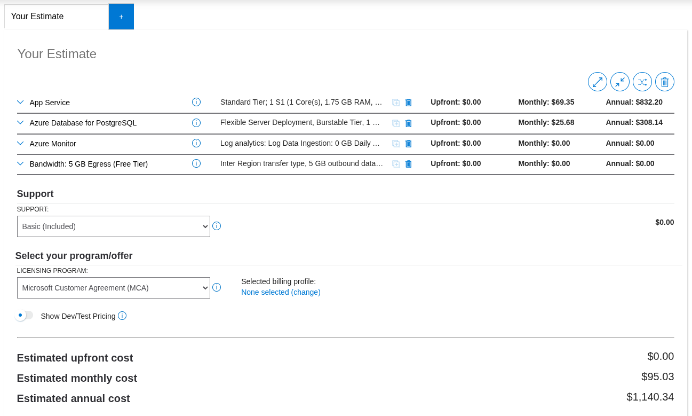

# Deliverable 3 - Cost Estimate Report

## 1. Architecture Summary
The **Fullshot** web application is deployed on Microsoft Azure using a robust and scalable architecture. The design prioritizes cost-efficiency for a startup while ensuring high availability and security through modern cloud practices.

- **Compute**: **Azure App Service (Linux)** hosted on a **Standard S1 Service Plan**. The Standard tier is selected specifically to enable **Autoscale** capabilities, allowing the application to handle traffic spikes.
- **Database**: **Azure Database for PostgreSQL (Flexible Server)** using the **Burstable B1ms** tier. This provides a balance of performance and cost, suitable for small to medium workloads with 32GB of SSD storage.
- **Security**: **Azure Key Vault (Standard)** is used to store sensitive database credentials. The App Service uses a **System-Assigned Managed Identity** to retrieve these secrets securely without hardcoding any passwords in the source code or environment variables.
- **Monitoring**: **Azure Application Insights** and **Log Analytics Workspace** are integrated to provide deep telemetry, performance monitoring, and error tracking.
- **Optimization (Scalability)**: An **Autoscale Setting** is configured to monitor CPU usage, automatically scaling the App Service between 1 and 3 instances based on load.

---

## 2. Itemized Cost Breakdown
The following estimate is based on the **East Asia (Hong Kong)** region as per the provided [Azure Pricing Calculator](https://azure.microsoft.com/en-us/pricing/calculator/) estimate.

| Azure Service | Configuration Details | Estimated Monthly Cost |
| :--- | :--- | :--- |
| **App Service Plan** | S1 Tier (Linux), 1 Instance Baseline | $69.35 |
| **PostgreSQL Flexible Server** | Burstable B1ms (1 vCore, 2GB RAM) + 32GB Premium SSD | $25.68 |
| **Azure Monitor** | Application Insights + Log Analytics (Free Tier) | $0.00 |
| **Bandwidth** | 5 GB Egress (Free Tier) | $0.00 |
| **Total Estimated Cost** | | **$95.03 / Month** |

*Note: Costs are based on the official Azure Pricing Calculator export for the East Asia region. Actual costs may vary depending on scaling events and specific IOPS usage.*

---

## 3. Azure Pricing Calculator Screenshot

---

## 4. Cost Optimization Notes
To further reduce the monthly expenditure, the following strategies can be implemented:

1. **Reserved Instances (RI)**: By committing to a 1-year or 3-year term for the **App Service Plan** and **PostgreSQL Server**, we can achieve savings of up to **35% - 60%** compared to pay-as-you-go pricing.
2. **Development/Test Scaling**: During non-business hours or development phases, the App Service Plan can be scaled down to a **B1 (Basic)** or **F1 (Free)** tier. Although this disables autoscaling, it significantly reduces costs when high availability is not required.
3. **Database Idle Suspension**: For development environments, PostgreSQL Flexible Server allows for "Stop" functionality, which halts compute costs while only charging for storage when the database is not in use.
4. **Serverless Migration**: Refactoring background tasks or infrequent API endpoints to **Azure Functions (Consumption Plan)** would allow these components to "scale-to-zero," incurring costs only when triggered.
